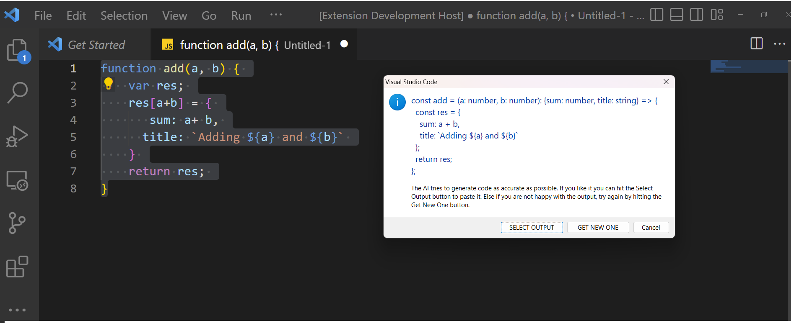
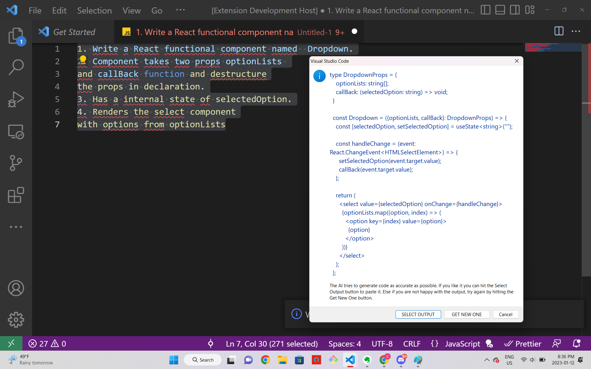
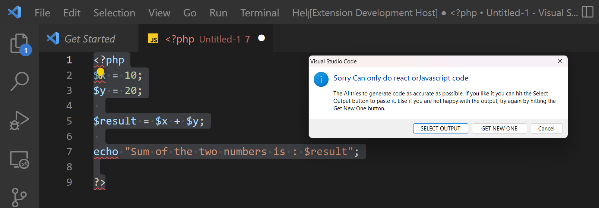
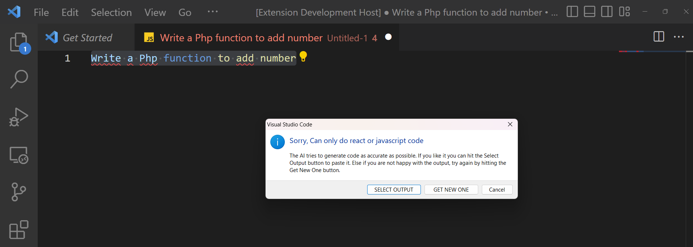
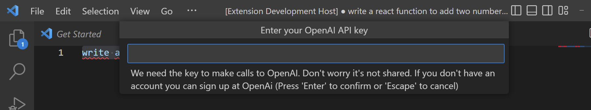

# react-typescript-generator README

This simple extension helps developers in their day to day life by simplifying coding.
It provides two functionality:

> User can select a piece of JavaScript code and the AI provides Typescript suggestions for it.  
> User can also provide detailed instructions in English for writing a React component or functions and the AI would generate a equivalent Typescript code.

All the code generated uses latest ES6 syntax.

## Features

It works as a guide for folks learning Typescript or React and provides them with different options in typescript.

> User can convert a piece of JavaScript code to Typescript by selecting it and using keyboard shortcut of `ctrl+atl+t` > 

> User can also write React code in Typescript from scratch, by giving simple instructions in English and using keyboard shortcut of `ctrl+atl+t` > 

> The extension is configured to only recognize JavaScript and write React from scratch, so the command in plain English should have React keyword or the code should be in JavaScript. Most cases the AI might not give you anything, but if you are lucky it might produce something.
>  > 

## Requirements

- You must have a OpenAI account. So sign up [here](https://openai.com/api/).
- After that create a `API Key` that will be used by you to make calls to OpenAi. You can navigate [here](https://beta.openai.com/account/api-keys) to make a new key.
- The API key is stored in secret storage and not shared with any other extension or user.

## Extension Settings

This extension contributes the following command that could be found by `shift+ctrl+p` in windows or `shift+cmd+p` in mac.

- `Convert To Typescript`: This commands takes the selected text and gets typescript suggestions for it.

The Extension also provides a key shortcut for the following command: `ctrl+alt+t`

## Known Issues

## Release Notes

Users appreciate release notes as you update your extension.

### 1.0.0

Initial release of Typescript-Es6.

---

**Enjoy!**
